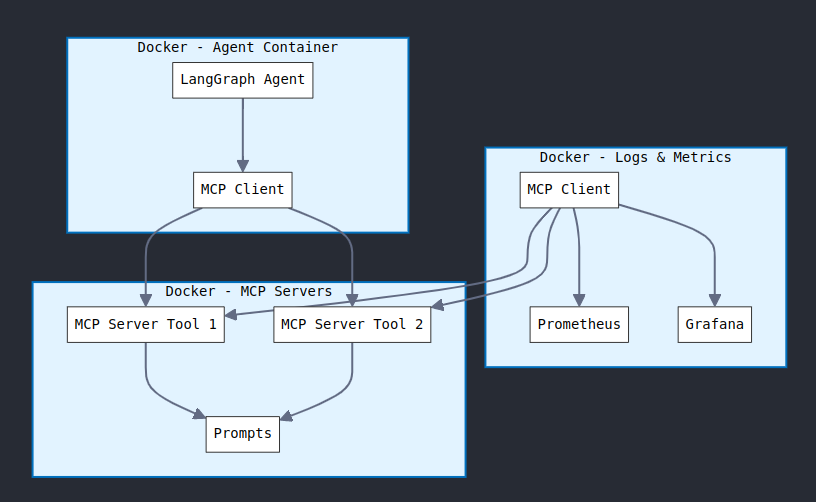

# IPL Tweet Generator

A specialized system that generates engaging and viral IPL cricket tweets using advanced prompt engineering. The system features multilingual tweet generation with Hindi and Marathi word integration for more authentic and culturally connected content, focusing particularly on Rohit Sharma's batting moments.

## System Architecture

This project follows the Model Context Protocol (MCP) architecture, which separates the agent logic from the tool implementations. The system consists of:

1. **MCP Servers**: Microservices that host tools and prompts
2. **Agent**: A client that connects to the MCP servers and uses their tools
3. **Metrics & Monitoring**: Components for tracking system performance and health

### MCP Architecture Overview

The MCP architecture allows for a modular design where:
- Prompts and domain-specific tools are hosted on dedicated servers
- Agents can connect to these servers via SSE (Server-Sent Events)
- Communication follows the MCP protocol, enabling interoperability



## Components

### MCP Servers

1. **Tweet Generator MCP Server (`mcp_servers/tweet_generator/`)**
   - Hosts the prompt templates for viral IPL tweets
   - Provides specialized prompt tools for different cricket content
   - Currently implements:
     - `get_rohit_sharma_boundary_viral_tweet_prompt`: For detailed viral tweets about Rohit's boundaries
     - `get_rohit_sharma_boundary_one_liner_tweet_prompt`: For ultra-short tweets (7-8 words) with multilingual support
   - Runs on port 3002 by default

### Agent

1. **IPL Tweet Agent (`agent/agent.py`)**
   - Main agent that generates expert and noob IPL tweets
   - Uses LangChain and LangGraph to create a ReAct agent
   - Connects to the Tweet Generator MCP server
   - Handles API requests and responses

2. **MCP Client Manager (`agent/mcp_client.py`)**
   - Handles connections to MCP servers
   - Collects tools from all servers for the agent to use

3. **Agent API Server (`agent/app.py`)**
   - Provides RESTful API for interacting with the agent
   - Handles HTTP requests and returns tweet responses

### Monitoring and Metrics

1. **Metrics Server (`logs_metrics/metrics_server.py`)**
   - Collects and exposes metrics about tweet generation and API usage
   - Provides endpoints for Prometheus to scrape metrics

2. **Prometheus & Grafana**
   - Monitor system health and performance
   - Visualize key metrics through dashboards
   - Track API requests, tweet generation time, and other important KPIs

## Specialized Features

### Multilingual Tweet Support

The system now includes support for generating tweets that incorporate Hindi and Marathi words, enhancing cultural connection and authenticity. This is especially important for cricket content in India where multilingual expressions are common among fans.

Example multilingual short tweet formats:
- "वाडापाव POWER! BALL SENT TO STANDS! 💥"
- "दबाके SHOT! HITMAN का JALWA! 🔥"
- "MASTER BLASTER! किती छान SIX! 👑"

### Rohit Sharma Specialized Prompts

The current implementation focuses on Rohit Sharma-specific tweet generation with customized prompts that capture his unique batting style, nicknames, and fan sentiments:

1. **Detailed Viral Tweets**
   - Comprehensive templates for longer, engagement-optimized tweets
   - Includes hashtags, emoji combinations, and signature references

2. **One-Liner Tweets**
   - Ultra-short 7-8 word tweets that pack maximum impact
   - Integrates Hindi/Marathi words for cultural authenticity
   - Perfect for quick posting during live matches

## How It Works

1. The MCP servers are started first, exposing their tools via SSE endpoints
2. The agent connects to these servers through the MCP Client Manager
3. When given a cricket moment:
   - The agent uses the appropriate tool to get a structured prompt (e.g., `get_rohit_sharma_boundary_viral_tweet_prompt`)
   - This prompt comes from the Tweet Generator MCP Server
   - The agent then uses this prompt to generate an expert viral tweet
   - Optionally, it can also generate a "noob" tweet for contrast

## Prompt Flow

The key insight is that the detailed prompt templates are hosted on the MCP server, not in the agent:

1. The agent starts with a basic system prompt (from `IPLTweetAgentPrompts.get_system_prompt()`)
2. When generating a tweet, the agent:
   - Sends the cricket moment to the MCP server
   - The MCP server formats a detailed prompt (using specialized prompt classes)
   - The server returns this formatted prompt to the agent
   - The agent uses this detailed prompt to generate the final tweet

This architecture allows prompt engineering experts to update the prompts on the MCP servers without changing the agent code.

## Getting Started

### Prerequisites

- Python 3.10+
- Docker and Docker Compose

### Setup

1. Clone the repository:
   ```
   git clone https://github.com/SuyodhanJ6/iplTweetNoobGenerator.git
   cd iplTweetNoobGenerator
   ```

2. Create a `.env` file with:
   ```
   OPENAI_API_KEY=your-openai-key-here
   MCP_HOST=127.0.0.1
   TWEET_MCP_PORT=3002
   AGENT_PORT=8000
   METRICS_PORT=9090
   PROMETHEUS_PORT=9091
   GRAFANA_ADMIN_USER=admin
   GRAFANA_ADMIN_PASSWORD=admin
   ```

3. Start the system with Docker Compose:
   ```
   docker-compose up --build
   ```

## Docker Deployment

The repository includes Dockerfiles for all components, allowing for containerized deployment.

To build and run with Docker Compose:

```
docker-compose up --build
```

This will start all services defined in the docker-compose.yml file:
- Agent API server on port 8000
- Tweet Generator MCP server on port 3002
- Metrics server on port 9090
- Prometheus on port 9091
- Grafana on port 3000

### Accessing the API

Once the system is running, you can generate tweets by sending a POST request to:
```
http://localhost:8000/generate-tweet
```

With a JSON body like:
```json
{
  "content": "Rohit Sharma just hit a massive six over mid-wicket against RCB, 92 meters into the crowd!"
}
```

### Accessing the Monitoring Dashboard

Once the system is running, you can access the Grafana dashboard at:
http://localhost:3000

Login with the credentials defined in your `.env` file (default: admin/admin)

## Future Enhancements

- Add more player-specific prompts beyond Rohit Sharma
- Implement prompts for other cricket moments (wickets, fielding, etc.)
- Add more languages and regional expressions
- Create a web UI for interacting with the agent
- Expand multilingual support to full tweets, not just one-liners
- Add sentiment analysis for generated tweets

## License

[MIT](LICENSE)

## Environment Setup

To properly configure the system, create a `.env` file in the root directory with the following variables:

```
# OpenAI API
OPENAI_API_KEY=your-openai-key-here

# MCP Server settings
MCP_HOST=127.0.0.1
TWEET_MCP_PORT=3002

# Agent API settings
AGENT_PORT=8000
API_HOST=0.0.0.0
MODEL_NAME=gpt-4o

# Metrics and Monitoring
METRICS_URL=http://metrics-server:9090
METRICS_PORT=9090
METRICS_HOST=0.0.0.0
PROMETHEUS_PORT=9091
ENVIRONMENT=development

# Grafana credentials
GRAFANA_ADMIN_USER=admin
GRAFANA_ADMIN_PASSWORD=admin

# Log settings
LOG_LEVEL=INFO
```

## Running the System

You can run the entire system using Docker Compose:

```bash
docker-compose up --build -d
```

This will start the following services:
- Agent API server on port 8000
- Tweet Generator MCP server on port 3002
- Metrics server on port 9090
- Prometheus on port 9091
- Grafana on port 3000

### Accessing the Monitoring Dashboard

Once the system is running, you can access the Grafana dashboard at:
http://localhost:3000

Login with the credentials defined in your `.env` file (default: admin/admin)

The dashboard provides real-time metrics for:
- Tweet generation requests
- Tweet generation time
- Tweet character count
- API health status